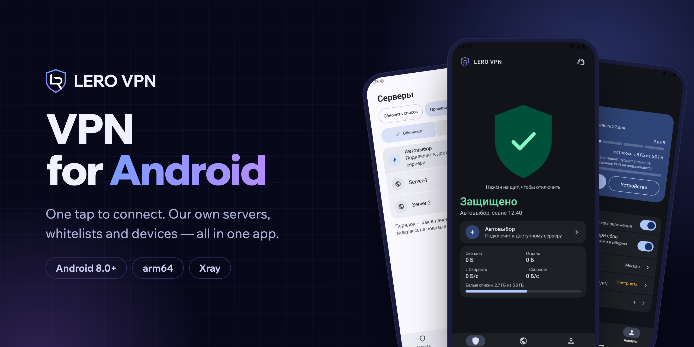
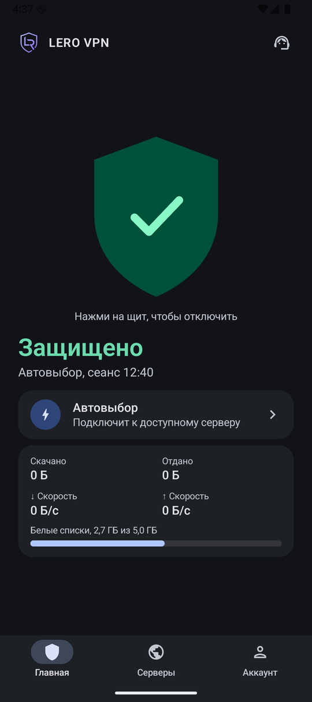
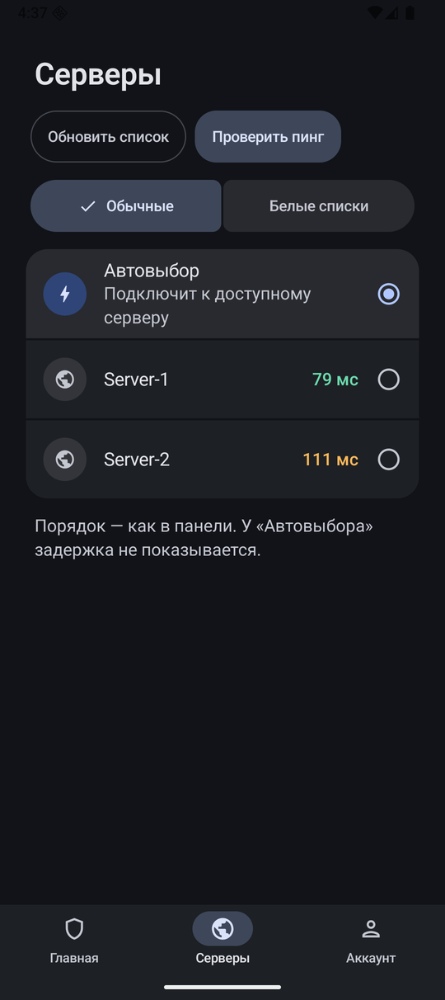
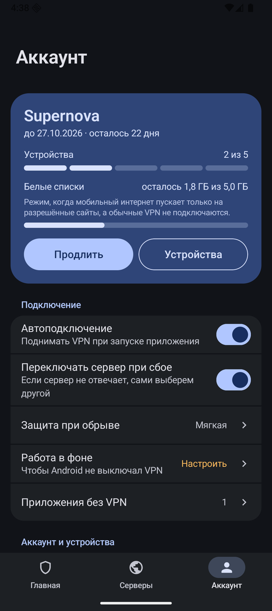
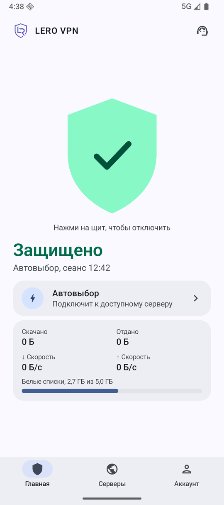
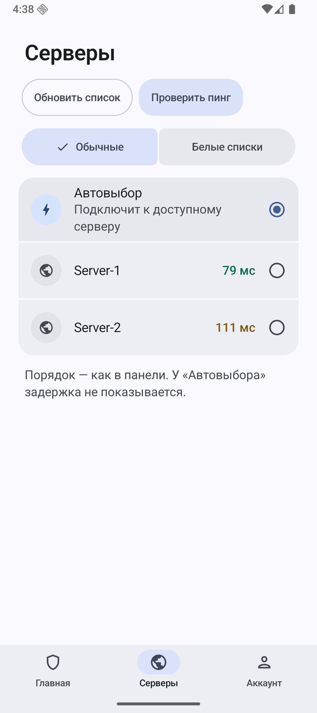
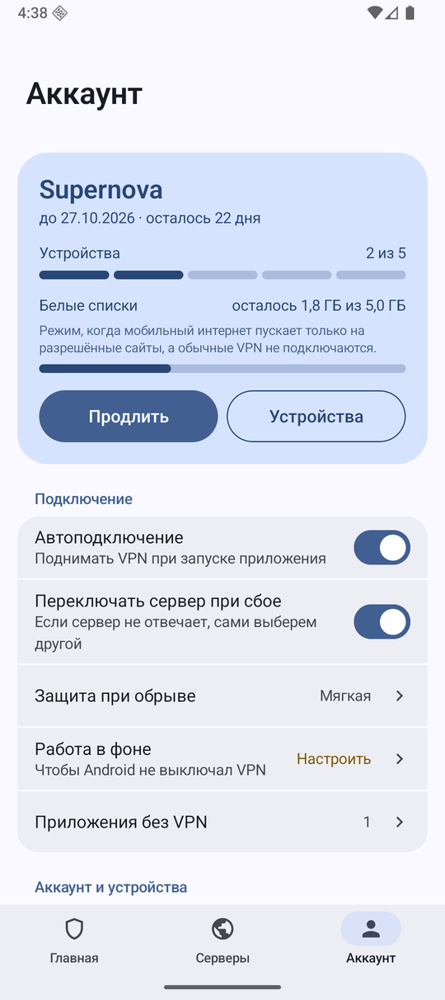

<p align="center">
  
</p>

<p align="center">
  <a href="README.md">Русский</a> · <b>English</b>
</p>

<p align="center">
  <a href="../../releases/latest"></a>
  
  
  <a href="https://t.me/LeroConnect_bot"></a>
</p>

# LERO VPN for Android

**LERO VPN** is a VPN running on its own infrastructure. One tap to connect, the server is picked for you and the connection is kept alive, while whitelists help you stay online when mobile internet only lets you reach approved sites.

## Features

- **One tap** — tap the shield and your traffic is protected. The server is picked automatically.
- **Whitelists** — dedicated servers for when your carrier only opens approved sites; usage is shown right on the home screen.
- **Servers** — same order as in the panel, latency on demand with “Check ping”.
- **Account** — plan, devices, remaining whitelist traffic, renewal.
- **Auto-connect, server failover and drop protection** — the VPN never silently disappears.
- **Apps without VPN** — choose which apps go direct.
- **Dark and light themes**, Russian and English — following your phone settings.
- **In-app updates** — new versions arrive on their own.

## Screenshots

<p align="center">
  
  &nbsp;
  
  &nbsp;
  
</p>

<details>
<summary>Light theme</summary>
<p align="center">
  
  &nbsp;
  
  &nbsp;
  
</p>
</details>

Screenshots show the Russian interface; the app switches to English automatically when your phone is set to English.

## Download

| Where | Link |
|---|---|
| Our website (main) | https://connect.leeroy.uz/download |
| GitHub (mirror) | [Latest release](../../releases/latest) |

It is the same file. Requires Android 8.0 or newer on an arm64 CPU — almost any phone from recent years.

## Install

1. Download the APK.
2. Android will ask whether to allow installs from your browser — allow it. You only need to do this once.
3. Open the app and sign in with the [Telegram bot](https://t.me/LeroConnect_bot) or with your subscription link. The subscription page has an “Add to LERO VPN” button.

You can get a subscription in the [bot](https://t.me/LeroConnect_bot) or on the [website](https://connect.leeroy.uz).

## Verify the file

Every release lists its **SHA-256** and a **VirusTotal** report link. To check the checksum:

```bash
# Linux
sha256sum lero-vpn-*.apk
# macOS
shasum -a 256 lero-vpn-*.apk
```

```powershell
# Windows
Get-FileHash lero-vpn-*.apk -Algorithm SHA256
```

It must match the one in the release. The APK is signed with the LERO VPN key: Android will not install an update signed by anyone else on top of it.

## Support

- Telegram support: [@LeroConnectSupport_bot](https://t.me/LeroConnectSupport_bot)
- Server status: https://connect.leeroy.uz/status
- Email: support@leeroy.uz

## Rights

© 2026 LERO VPN. All rights reserved.

The app uses open-source components: [Xray-core](https://github.com/XTLS/Xray-core) (MPL-2.0), [libXray](https://github.com/XTLS/libXray) (MIT).
