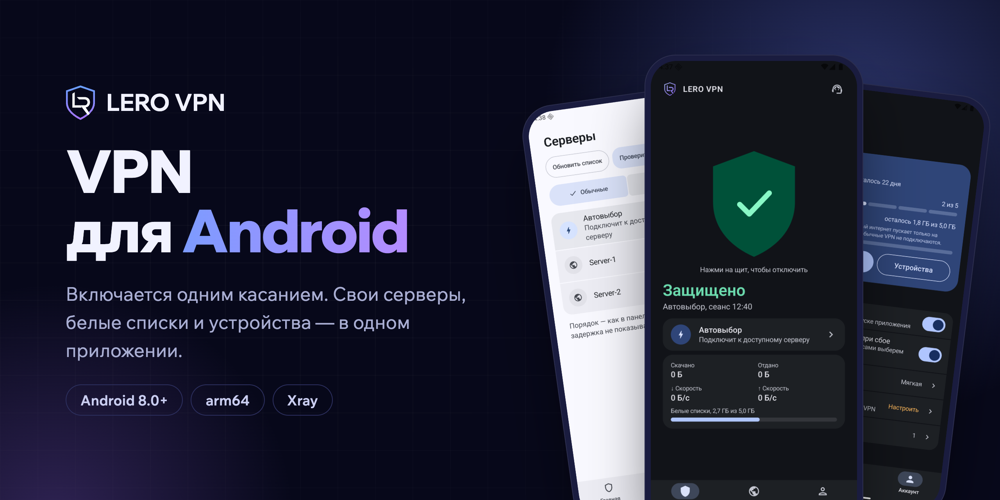

<p align="center">
  
</p>

<p align="center"><b>Русский</b> · <a href="README.en.md">English</a></p>

<p align="center">
  <a href="https://connect.leeroy.uz/download"></a>
  <a href="../../releases/latest"></a>
</p>

VPN в одно касание: сервер выбирается сам, а белые списки помогают оставаться на связи, когда мобильный интернет пускает только на разрешённые сайты. Android 8.0 и новее.

<p align="center">
  
  
  
</p>

## Установка

1. Скачай APK — с сайта или отсюда, файл один и тот же.
2. Разреши установку из браузера, когда Android спросит.
3. Войди через [Telegram-бота](https://t.me/LeroConnect_bot) или по ссылке подписки.

Обновления приходят прямо в приложении.

## Проверка файла

У каждого выпуска указаны SHA-256 и отчёт VirusTotal.

<details>
<summary>Как сверить SHA-256</summary>

```bash
shasum -a 256 lero-vpn-*.apk          # macOS / Linux
Get-FileHash lero-vpn-*.apk           # Windows (PowerShell)
```
</details>

## Поддержка

[@LeroConnectSupport_bot](https://t.me/LeroConnectSupport_bot) · [Статус серверов](https://connect.leeroy.uz/status)

<sub>© 2026 LERO VPN. Использует Xray-core (MPL-2.0) и libXray (MIT).</sub>
